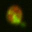
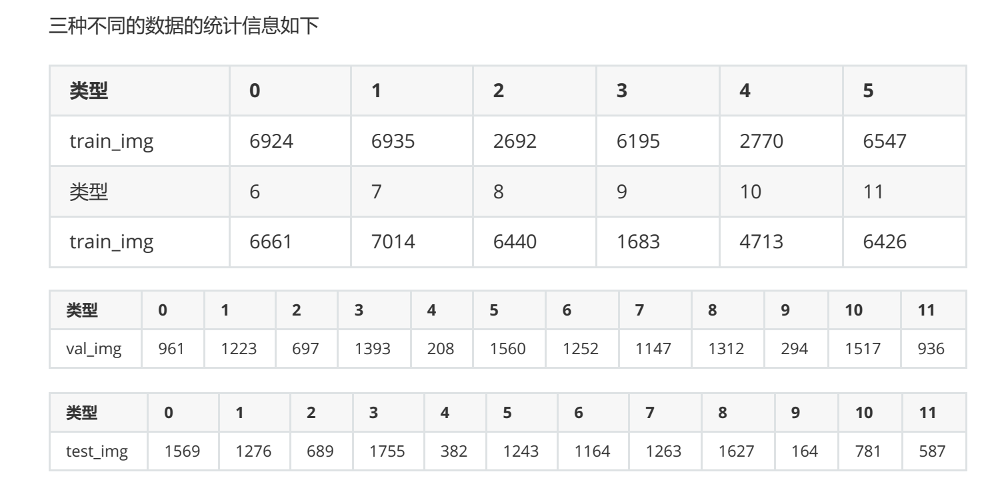
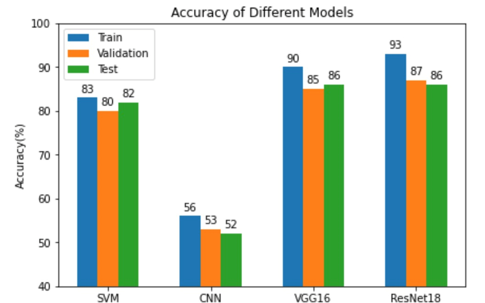

# README

## Background

This is a modest deep learning project on the classification of subcellular images of fluorescent proteins.

In this project, I collaborated with my classmates to implement the task using several classical models of computer vision such as ordinary multilayer perceptron, VGG-16, support vector machine(SVM), Resnet, etc. The models were built using python `pytorch`, and the exact code is in the `code` folder. The `PPT` folder and the `Report` folder contain the PPT (including the lecture video) and the written report submitted for our eventual course defence, respectively. And the data examples we used are in the `data` folder, which contains segmented high-throughput microscopy image data from a study by Pärnamaa and Parts (2017). 

One Example:

They used data from Chong et al. (2015), which is stored in the CYCLoPs database (Koh et al., 2015), before segmentation or cropping. They cropped 64x64 pixel blocks centred on a single cell from the microscope images, so there may be other surrounding cells with the same fluorescence pattern. The specific fluorescence pattern of a cell provides information about the subcellular location. The red and green channels in the image mark the location of cell bodies and proteins, respectively. The dataset consists of 65,000 training samples, 12,500 validation samples, and 12,500 test samples from 12 subcellular localisation categories (pericellular, cytoplasmic, endosomal, endoplasmic reticulum, Golgi, mitochondrial, nuclear periphery, nucleolus, nucleus, peroxisomes, spindle poles, and vesicles), which are imbalanced in number of samples.

 

The final accuracy we obtained for each model under each dataset is shown below:

## Summary

### Comparison between machine learning models and deep learning models

Based on the results, we can see that SVM can outperform the simple Convolutional Neural Network CNN in terms of classification ability and this is due to the fact that:

Deep learning is data-driven, so it is easy for deep learning models to overfit when the amount of data is small. In our experiments, the

train dataset is significantly more accurate, SVM does not require a lot of tuning, and after choosing the appropriate kernel function, it has good nonlinear classification ability, and shows good classification ability even with a small amount of data.

However, the training time of SVM is significantly longer than that of deep learning networks, which is due to the fact that in deep learning we use GPU acceleration for matrix operations, and deep learning algorithms rely heavily on high-end machines, contrary to traditional machine learning algorithms, which can run on low-end machines. Deep learning algorithms essentially do a lot of matrix multiplication operations, and using the GPU effectively optimises these operations.

### Comparison between deep learning models

Deep learning requires a lot of hyper-parameter settings compared to machine learning. As you can see from the graph, as the number of network layers deepens, the accuracy of VGG improves compared to CNN, but at the same time, the deeper the network layers are, the longer the training time is and the easier it is to encounter network degradation, so we introduced ResNet to solve the degradation problem by using the shortcut connection. Therefore, we introduce ResNet to solve the degradation problem through shortcut connection, and we can see that 18 layers of ResNet can achieve the best classification effect in this dataset. This shows that ResNet is very effective in solving the degradation problem.

# README

## Background

这是一个不大不小的深度学习项目，它的主题是：荧光蛋白亚细胞图像的分类。

该项目中，我和同学合作使用了计算机视觉多个经典模型如普通多层感知机,VGG-16,支持向量机，Resnet等实现该任务，其各个模型均是通过python pytorch搭建的，具体代码在`code`文件夹中。`PPT`文件夹和`Report`文件夹分别包含了我们最终进行课程答辩时使用的PPT（包括讲解视频）以及提交的书面报告。而我们使用的数据在`data`文件夹中，包含了经过分割的高通量显微镜图像数据，数据来源于Pärnamaa和Parts（2017）的研究。 他们在分割或裁剪之前使用了Chong等人（2015）的数据，该数据存储在CYCLoPs数据库（Koh等人， 2015）中。他们从显微镜图像中裁剪出以单个细胞为中心的64x64像素块，因此可能还有其他周围细胞具有 相同的荧光模式。细胞的特定荧光模式提供了亚细胞位置的信息。图像中的红色和绿色通道分别标记细胞本 体和蛋白质的位置。该数据集包括65,000个训练样本、12,500个验证样本和12,500个测试样本，来自12个亚 细胞定位类别（细胞周边、细胞质、内体、内质网、高尔基体、线粒体、核周边、核仁、细胞核、过氧化物 酶体、纺锤极和液泡），这些类别的样本数量是不平衡的。

最终我们得到的各个模型在各个数据集下的准确性如下图所示：

## 总结

### 机器学习模型与深度学习模型之间的比较

根据结果，我们可以看出，SVM的分类能力可以超过简单的卷积神经网络CNN，这是由于：

深度学习是数据驱动的，因此在数据量小的情况下，深度学习模型很容易过拟合。在我们的实验中，

train数据集的准确率明显更高，SVM无需大量调参，选择合适的kernel函数后，具有很好的非线性分类能力，在数据量不大的情况也展现出很好的分类能力。

但是SVM的训练时间明显长于深度学习网络，这是由于在深度学习中我们使用GPU加速进行矩阵运算，深度学习算法在很大程度上依赖于高端机器，这与传统的机器学习算法相反，后者可以在低端机器上运行。深度学习算法本质上是做大量的矩阵乘法运算，而使用GPU可以有效的优化这些操作。

### 深度学习模型之间的比较

深度学习相比于机器学习需要大量的超参数设置，从图中可以看到，随着网络层数的加深，VGG与CNN相比，准确率提高，但是于此同时，网络层越深，训练时间越长，而且越容易遇到网络退化问题，因此我们引入ResNet，通过残差连接(shortcut connection)解决退化问题，可以看到18 layer的ResNet能够达到本数据集的最好的分类效果。这说明ResNet在解决退化问题上是十分有效的。
